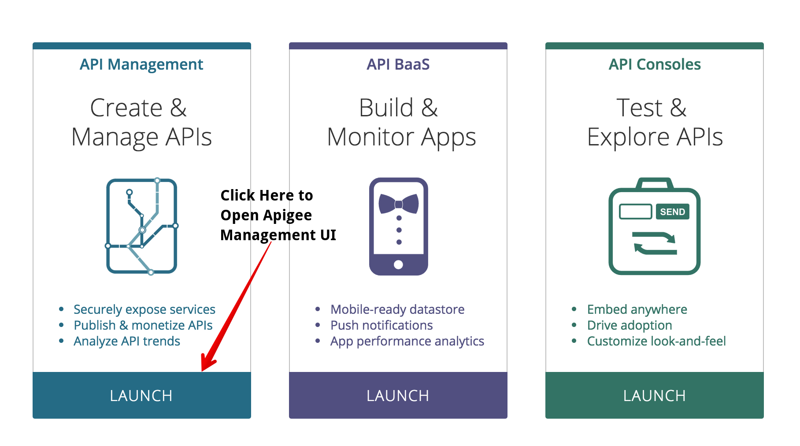

# adaptordie

Welcome to the Apigee Adapt or Die hands on DevJam workshop.

# Getting Started

  In this DevJam you will get first hand exposure to Apigee Edge, the industry's leading API Management platform. To get started with Apigee Edge, you will need to create an account and set up a free trial instance of Apigee Edge that you can use to build our labs today.

   If you're new to Apigee, visit this page to create an account: <a href="https://accounts2.apigee.com/accounts/sign_up" target="_blank">https://accounts2.apigee.com/accounts/sign_up</a>

  If you already have a trial account with Apigee, you can skip this step and use your existing instance. Access your Apigee instance by signing in here: <a href="//https://login.apigee.com/login" target="_blank">https://login.apigee.com/login</a>. 

  After signing into your new account you will see the Apigee launch page:

  

  Select the *Launch* button under the *Create and Manage APIs* to access the Apigee Edge Management UI. This should take you to the Dashboard of the Apigee Edge Management UI:

    


# Hands on Labs

1.  [Getting Familiar with the API](lab1.md)
2.  [Exposing the API through Apigee Edge](lab2.md)
3.  Throttling the API with Spike Arrest
4.  Improving API performance with Caching
5.  Complete reservation check in using the API


* Login to https://enterprise.apigee.com using your credentials

*** Create new API proxy using the below Open API spec: ***
  * Copy http://playground.apistudio.io/b50a8b64-b5ef-48a8-a0b2-1ed87e84e07f/spec
  * Update the Existing API to http://escapade-prod.apigee.net/adventures


POSTMAN link to import the collection - https://www.getpostman.com/collections/40b87157f7b653febeb8

# 1) Make Reservation
  
  URL: http://{org}-{env}.apigee.net/adventures/reservations
 
  Method: POST
 
  Header:
  Content-Type: application/json
  
  Request:
  
```
    {
     "memberId": "your_memberId", //Provide your member ID as per your registration
     "preferences": [
       {
         "roomType": "seaView", //seaView, mountainView, cityView
         "cuisine": "indian", //indian, mexican, italian, chinese
         "outdoors": "snorkelling", //snorkelling, scuba
         "leisure": "spa" //spa, yoga
       }
     ]
    }
```

Copy the response and paste it in a text editor, for example

 Response:

```
{
  "reservationId": "****",
  "passCode": "*****",
  "status": "confirmed"
}
```

# 2) Get Reservation

URL: http://{org}-{env}.apigee.net/adventures/reservations/{reservationId}
 
  Method: GET
 
  Header:
  Content-Type: application/json

Response:
 
 ```
 {
  "memberId": "your_memberId",
  "status": "confirmed",
  "preferences": [
    {
      "roomType": "seaView",
      "cuisine": "indian",
      "outdoors": "snorkelling",
      "leisure": "spa"
    }
  ]
}
```

# 3) Check-In

  URL: http://{org}-{env}.apigee.net/adventures/reservations/{reservationId}/checkin
 
  Method: POST
 
  Header:
  Content-Type: application/json
  
  Request:
  
```
{
	"memberId":"your_memberId",
	"passCode":"****"
}
```

To access Adapt or Die developer portal - click http://dev-adaptordie.devportal.apigee.com/
