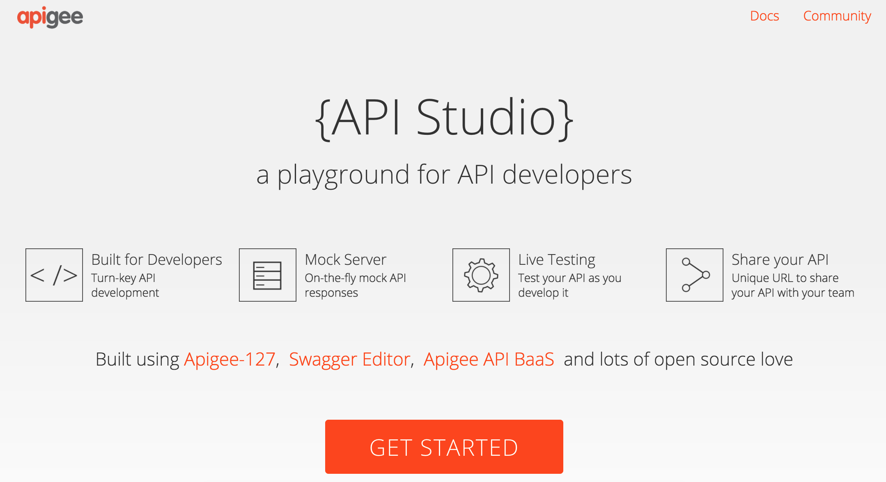
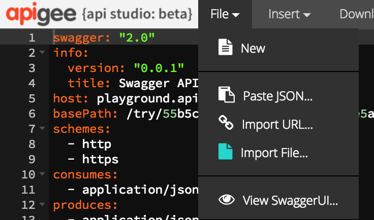
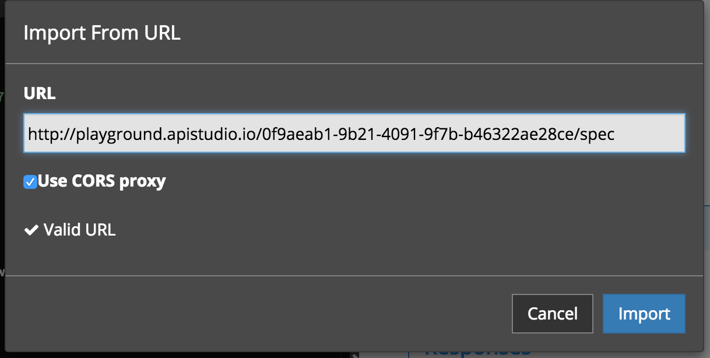

# Getting Familiar with the API

In this lab, we'll explore the API that we'll be using for the duration of this workshop. The API exposes a simplified Reservation system. The API has three resources:

`GET /reservations/{reservationId}` - Retrieve details about a reservation

`POST /reservations` - Create a new reservation

`POST /reservations/{reservationId}/checkIn` - Performs a check-in for the specified reservation

# Open the API in API Studio

We'll start this lab by opening the OpenAPI specification for our API in API Studio, Apigee's API modeling and design tool. To access API Studio, visit: <a href="https://apistudio.io" target="_blank">https://apistudio.io</a>

On the API Studio landing page, click on the *Get Started* button to launch the API design view:

# Import the OpenAPI Secification

If this is your first time accessing API Studio, you will see some helpful tips which you can click through for the purposes of this lab. Dismiss the header tutorial message so that you are able to see the main menu by clicking on the white X in the top right of your window:

Once the main menu is visibile, select `File -> Import URL...` to import the OpenAPI Specification we'll be working with today.

When the dialog appears, copy the following URL into the URL field: <a href="http://playground.apistudio.io/0f9aeab1-9b21-4091-9f7b-b46322ae28ce/spec" target="_blank">http://playground.apistudio.io/0f9aeab1-9b21-4091-9f7b-b46322ae28ce/spec</a>

