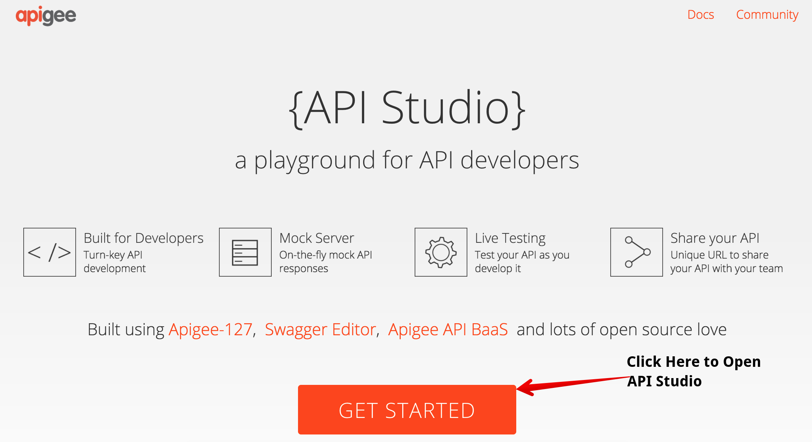
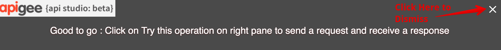
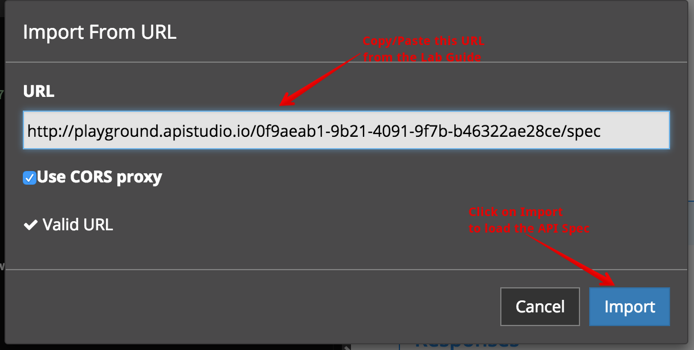
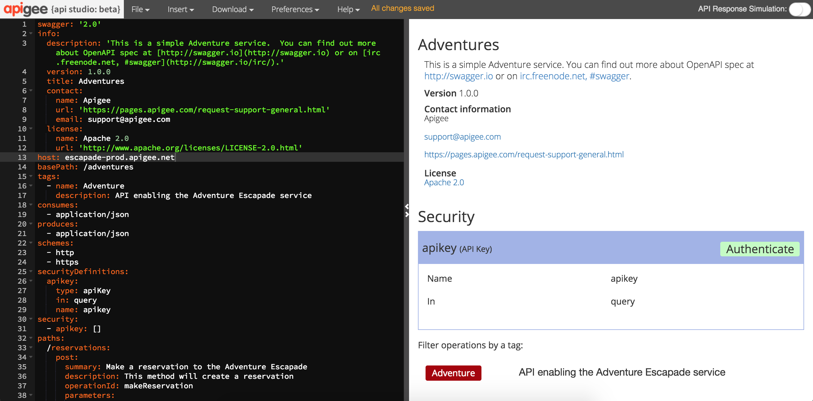
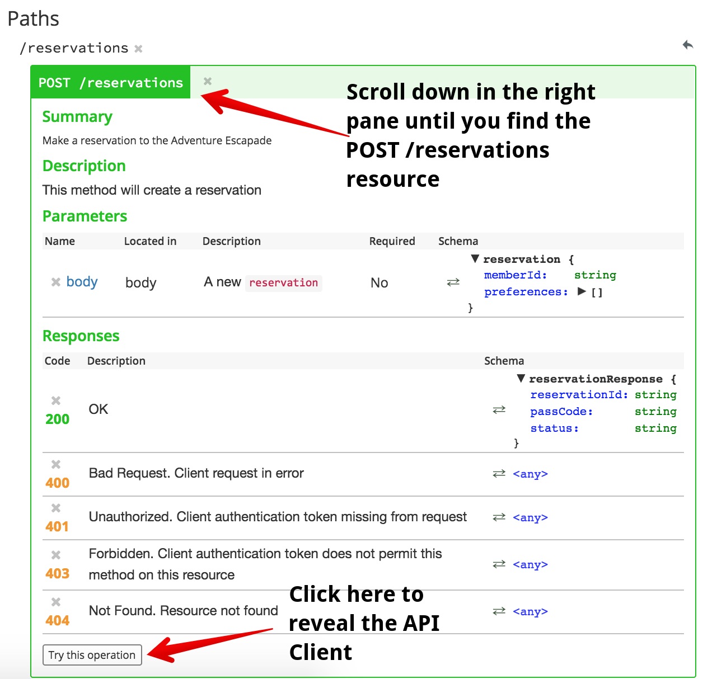
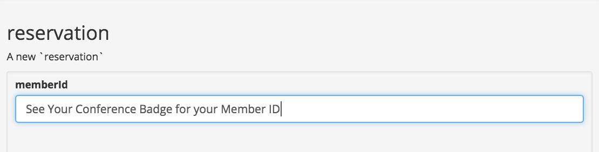
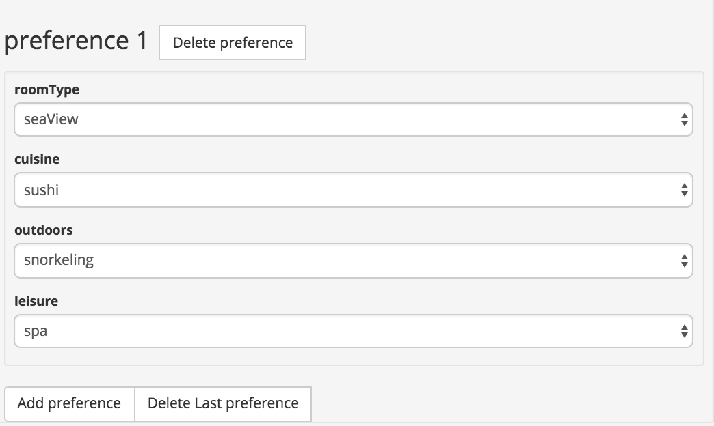
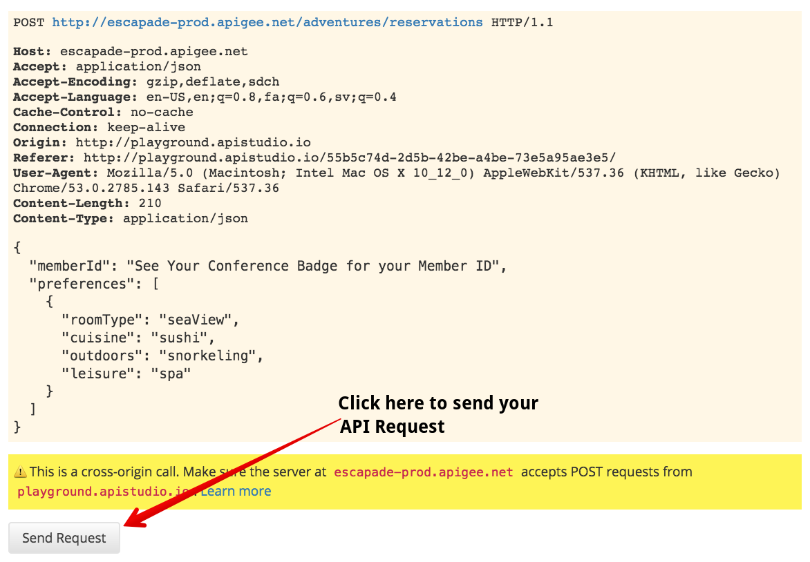
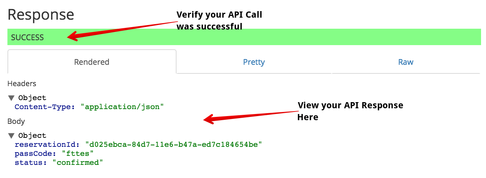
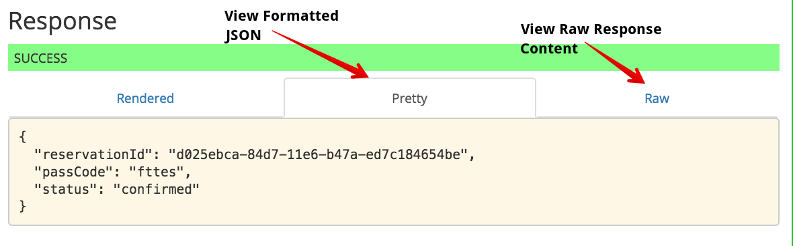

# Lab 1 - Getting Familiar with the API

In this lab, we'll explore the API that we'll be using for the duration of this workshop. The API exposes a simplified Reservation system. The API has three resources:

`GET /reservations/{reservationId}` - Retrieve details about a reservation

`POST /reservations` - Create a new reservation

`POST /reservations/{reservationId}/checkIn` - Performs a check-in for the specified reservation

# Open the API in API Studio

We'll start this lab by opening the OpenAPI specification for our API in API Studio, Apigee's API modeling and design tool. To access API Studio, visit: <a href="https://apistudio.io" target="_blank">https://apistudio.io</a>

On the API Studio landing page, click on the *Get Started* button to launch the API design view.

# Import the OpenAPI Secification

If this is your first time accessing API Studio, you will see some helpful tips which you can click through for the purposes of this lab. Dismiss the header tutorial message so that you are able to see the main menu by clicking on the white X in the top right of your window:

Once the main menu is visibile, select `File -> Import URL...` to import the OpenAPI Specification we'll be working with today.

When the dialog appears, copy the following URL into the URL field: <a href="http://playground.apistudio.io/0f9aeab1-9b21-4091-9f7b-b46322ae28ce/spec" target="_blank">http://playground.apistudio.io/0f9aeab1-9b21-4091-9f7b-b46322ae28ce/spec</a>

Once you've copied the URL into the URL field, click on *Import* to load the OpenAPI specification into the designer. You should then see a view that looks like this:

# Create a Reservation

API Studio is useful tool for not only designing your APIs, but also for quickly experimenting with an API from its OpenAPI specification. On the right hand pane, you'll see a preview of your API documentation with the option to try the API directly from your browser. Scroll down until you see the documentation for the `POST /reservations` resource. This is the API call you can use to create a new reservation:

Click on the *Try this operation* button. This will reveal a web form that you can use to craft a new request for your API. 

On your conference badge, you should see a member ID. Enter that member ID in the `memberid` field:

Click on the *Add Preference* button to specify your preferences for this reservation:

Once you have entered your preferences and member ID, scroll down to see a preview of the HTTP request that will be sent to the API.

To send the request, click on the *Send Request* button. This will make a live API call to create your reservation. If all works as expected, you should see a successful response:

To see the formatted JSON that was received in the response, click on the *Pretty* tab:

# Up Next

Now that you are familiar with the API, you're ready to configure your Apigee Edge instance to quickly make a number of important improvements to the API. When you're ready, you can get started on [Lab 2 - Exposing the API through Apigee Edge](lab2.md).
