# Lab 2 - Exposing the API through Apigee Edge

In this lab, you will create an API Proxy inside of Apigee Edge using the Management UI. You can access the Management UI by visiting <a href="https://enterprise.apigee.com" target="_blank">https://enterprise.apigee.com</a>

If you do not have an Apigee account, please go back to the *Getting Started* section of the [project overview page](README.md) and follow the instructions there to get your account set up.

Once you have accessed the Management UI, you should see a Dashboard page that looks similar to this:

# Creating the API Proxy

From the Management UI dashboard, select the APIs -> API Proxies option from the main menu at the top of the page. 

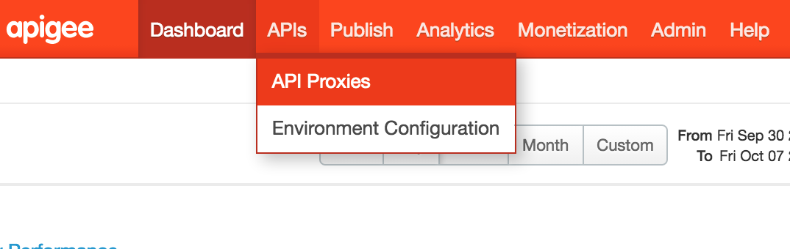

This will take you to a list of all the *API Proxies* that have been created in your Apigee Edge instance (called an organization in Apigee terminology). 

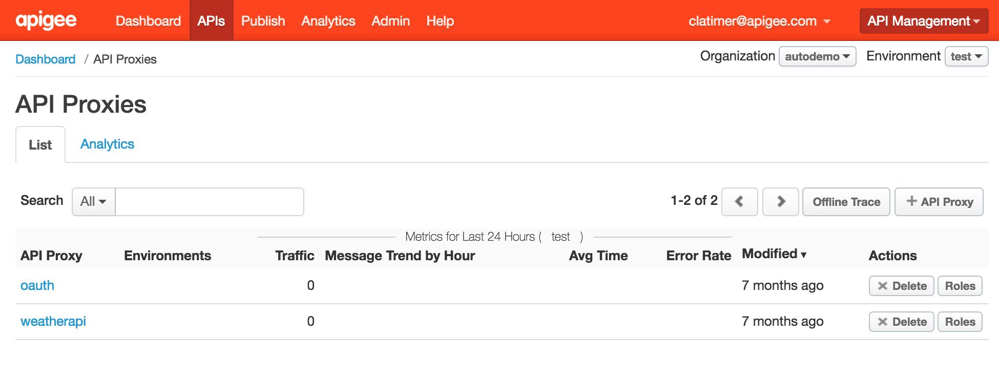

API Proxies are the building blocks for creating APIs in Apigee Edge. Create a new API Proxy now by clicking on the *+ API Proxy* button 

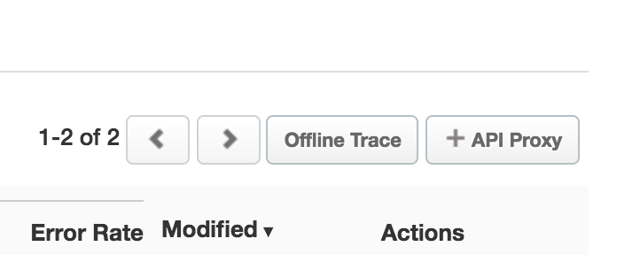

This will launch the API Proxy creation wizard:

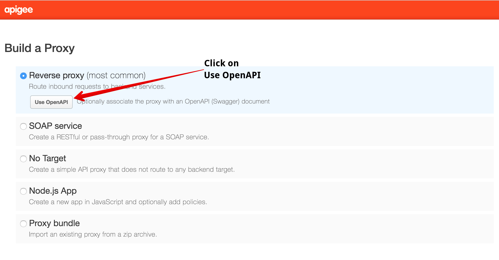

Select the first option *Reverse proxy (most common)* and click on the *Use OpenAPI* button. This will bring up a dialog box asking you for a URL that points to your OpenAPI specification. 

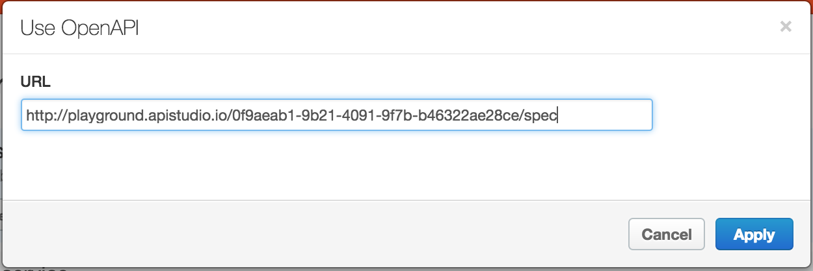

In the URL field, enter the same URL that you used to import the API specification in API Studio: <a href="http://playground.apistudio.io/0f9aeab1-9b21-4091-9f7b-b46322ae28ce/spec" target="_blank">http://playground.apistudio.io/0f9aeab1-9b21-4091-9f7b-b46322ae28ce/spec</a> Then click the *Apply* button.

You should now see the OpenAPI document URL correctly specified on the screen:

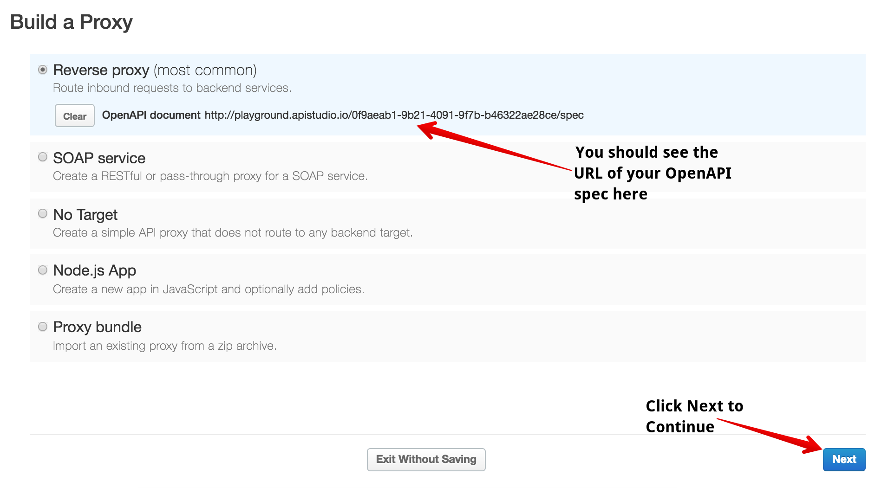

Click the blue *Next* button at the bottom right to continue.

The next page you will see allows you to customize the name and description of your API as well as the URI pattern that Apigee Edge will use to associate an incoming API call with your new proxy. In this case, any API calls which have a base path starting with `/adventures` will be handled by this proxy. 

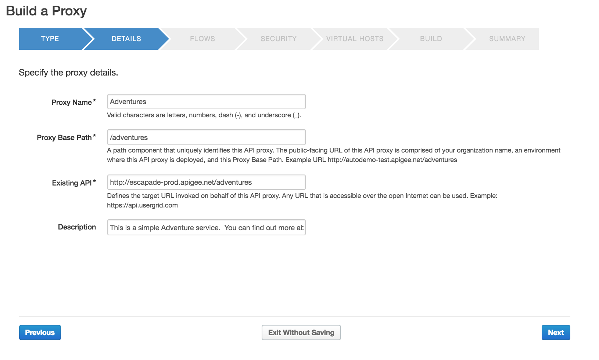

You do not need to modify any of these values. Click the blue *Next* button at the bottom right of your screen to continue.

The next screen will allow you to configure the resources in your OpenAPI specification that you would like to expose through your new API Proxy.

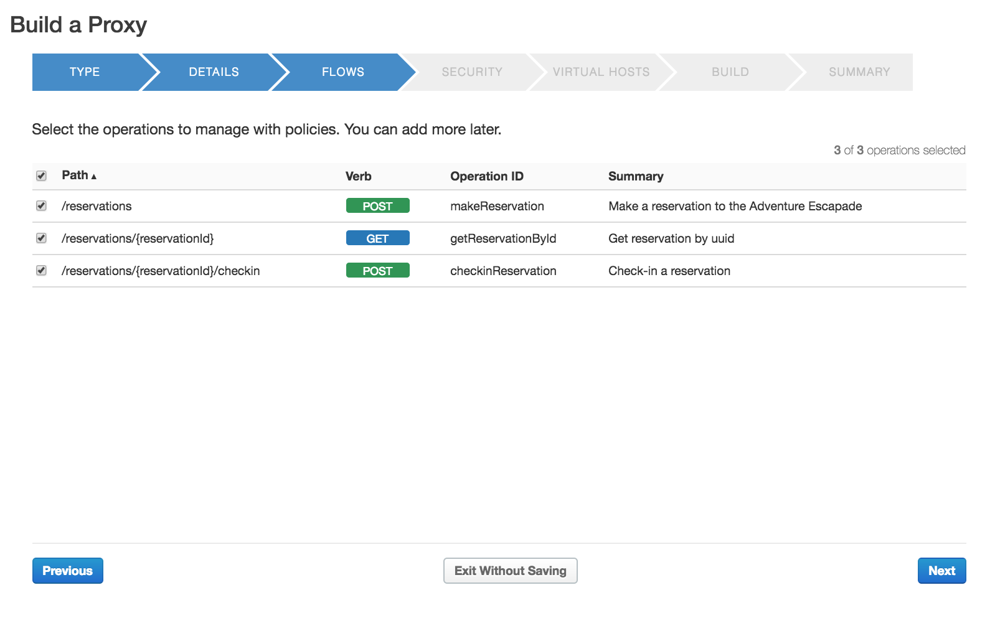

You do not need to modify any of these values. Click the blue *Next* button at the bottom right of your screen to continue.

The next screen will allow you to configure security on your new API Proxy:

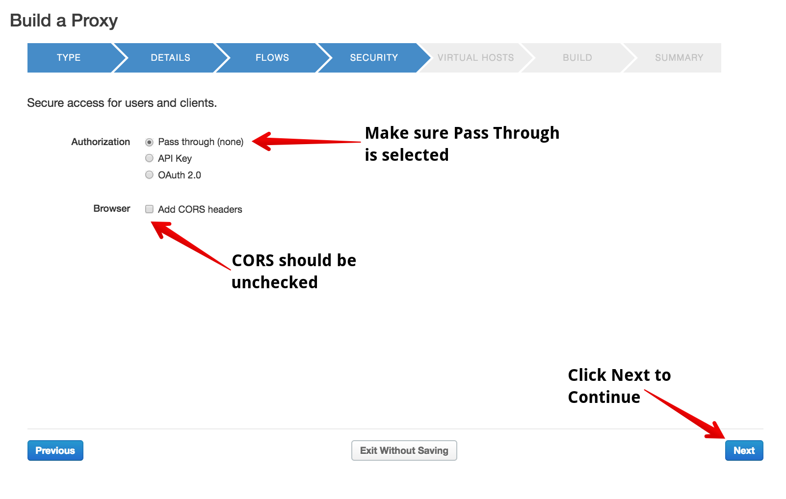

The default setting is to implement OAuth security for your API, however for the purposes of this lab we are going to change this setting to use the *Pass through (none)* option:

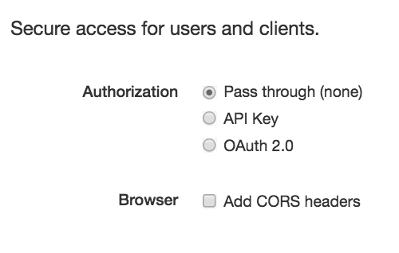

Ensure your settings are exactly as specified in the above image, then click the blue *Next* button at the bottom right of your screen to continue.

The next screen will allow you to specify the Virtual Hosts you would like to bind your API proxy to. In the trial instance you are using, these will all use apigee.net domains. For production customers, these would usually be a custom domain for your company such as api.yourcompany.com:

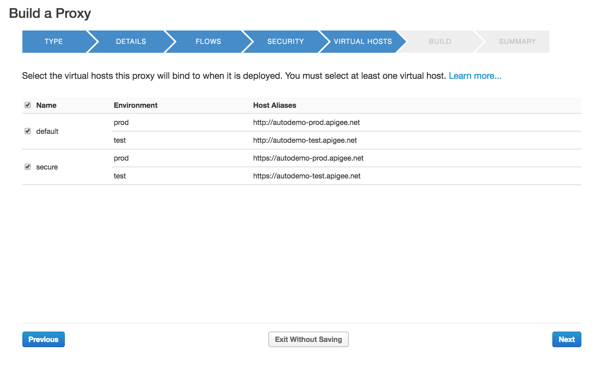

You do not need to modify any of these values. Click the blue *Next* button at the bottom right of your screen to continue.

The final step in the wizard allows you to review your configuration and specify which environments you would like to deploy your proxy to. In your trial organization, there will be two preconfigured environments, test and prod. In a production instance of Apigee, you can configure multiple environments to align with your SDLC process.

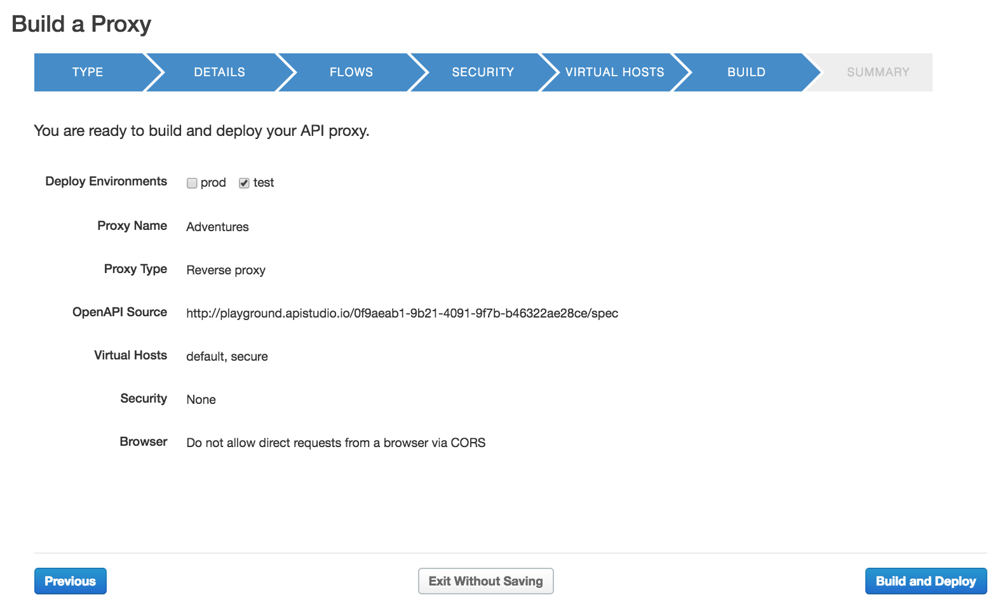

You do not need to modify any of these values. Click the blue *Build and Deploy* button at the bottom right of your screen to continue.

You should see progress indicators on your browser as Apigee Edge deploys your new proxy. Upon completion, you should see a confirmation page showing that your proxy has been created and deployed successfully:

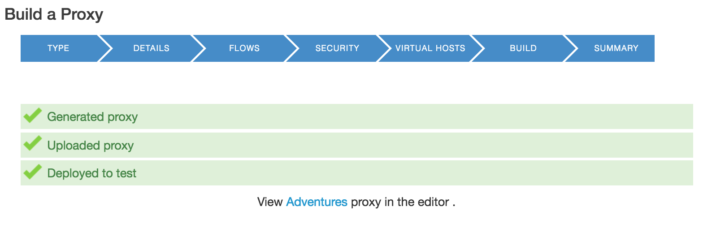

Click on the *Adventures* link to open up your new proxy in the API Proxy editor. This will launch the API Proxy Editor and you should see a page that looks like this:

