# Lab 2 - Exposing the API through Apigee Edge

In this lab, you will create an API Proxy inside of Apigee Edge using the Management UI. You can access the Management UI by visiting <a href="https://enterprise.apigee.com" target="_blank">https://enterprise.apigee.com</a>

If you do not have an Apigee account, please go back to the *Getting Started* section of the [project overview page](README.md) and follow the instructions there to get your account set up.

Once you have accessed the Management UI, you should see a Dashboard page that looks similar to this:

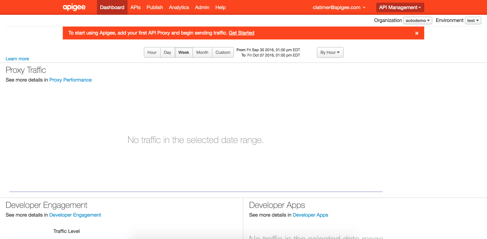

# Creating the API Proxy

From the Management UI dashboard, select the APIs -> API Proxies option from the main menu at the top of the page. 

This will take you to a list of all the *API Proxies* that have been created in your Apigee Edge instance (called an organization in Apigee terminology). API Proxies are the building blocks for creating APIs in Apigee Edge. Create a new API Proxy now by clicking on the *+ API Proxy* button 

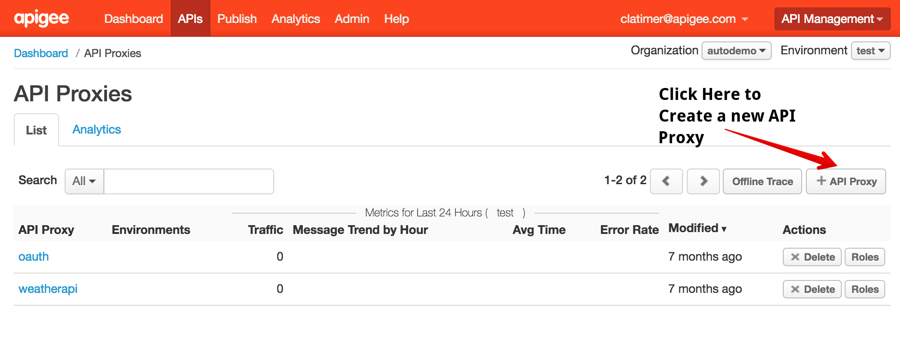

This will launch the API Proxy creation wizard:

Select the first option *Reverse proxy (most common)* and click on the *Use OpenAPI* button. This will bring up a dialog box asking you for a URL that points to your OpenAPI specification. 

In the URL field, enter the same URL that you used to import the API specification in API Studio: <a href="http://playground.apistudio.io/0f9aeab1-9b21-4091-9f7b-b46322ae28ce/spec" target="_blank">http://playground.apistudio.io/0f9aeab1-9b21-4091-9f7b-b46322ae28ce/spec</a> Then click the *Apply* button.

You should now see the OpenAPI document URL correctly specified on the screen:

Click the blue *Next* button at the bottom right to continue.

The next page you will see allows you to customize the name and description of your API as well as the URI pattern that Apigee Edge will use to associate an incoming API call with your new proxy. In this case, any API calls which have a base path starting with `/adventures` will be handled by this proxy. 

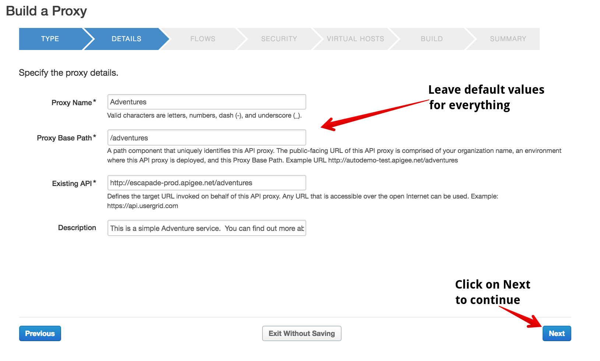

You do not need to modify any of these values. Click the blue *Next* button at the bottom right of your screen to continue.

The next screen will allow you to configure the resources in your OpenAPI specification that you would like to expose through your new API Proxy.

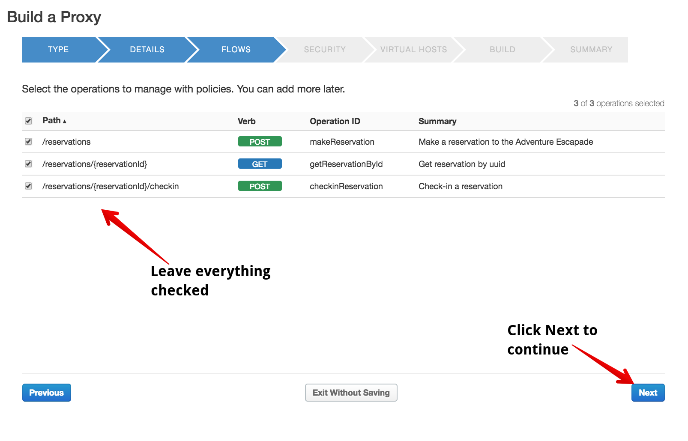

You do not need to modify any of these values. Click the blue *Next* button at the bottom right of your screen to continue.

The next screen will allow you to configure security on your new API Proxy. The default setting is to implement OAuth security for your API, however for the purposes of this lab we are going to change this setting to use the *Pass through (none)* option:

Ensure your settings are exactly as specified in the above image, then click the blue *Next* button at the bottom right of your screen to continue.

The next screen will allow you to specify the Virtual Hosts you would like to bind your API proxy to. In the trial instance you are using, these will all use apigee.net domains. For production customers, these would usually be a custom domain for your company such as api.yourcompany.com:

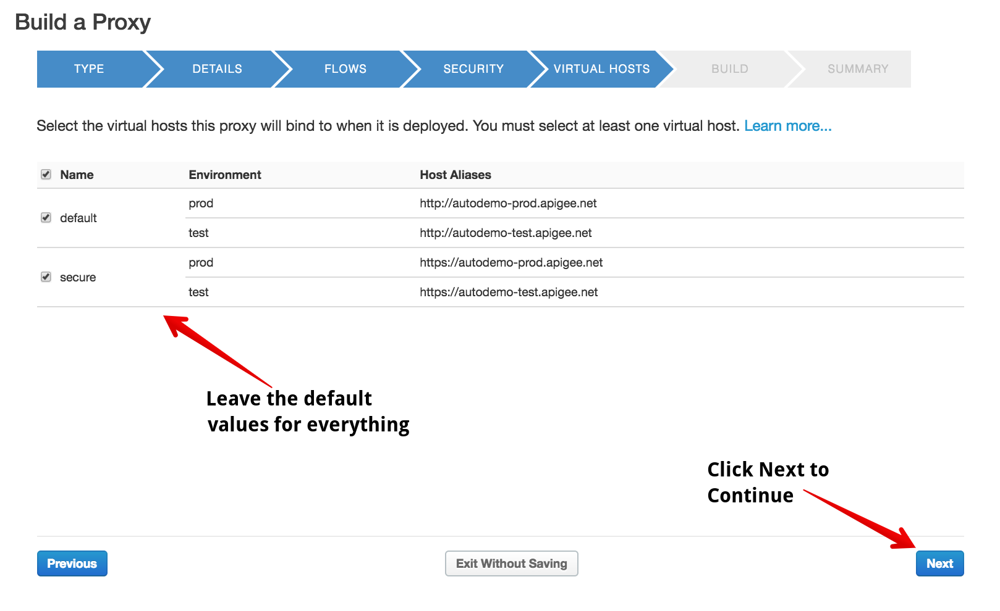

You do not need to modify any of these values. Click the blue *Next* button at the bottom right of your screen to continue.

The final step in the wizard allows you to review your configuration and specify which environments you would like to deploy your proxy to. In your trial organization, there will be two preconfigured environments, test and prod. In a production instance of Apigee, you can configure multiple environments to align with your SDLC process.

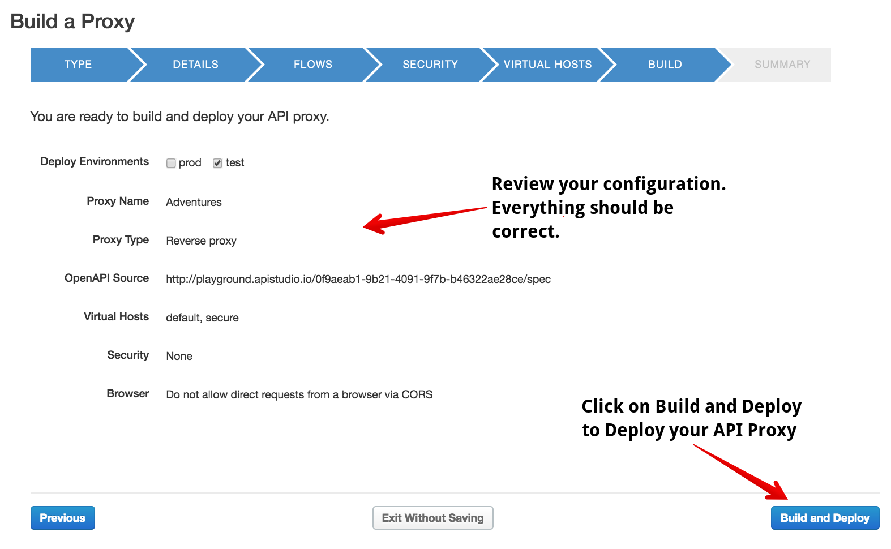

You do not need to modify any of these values. Click the blue *Build and Deploy* button at the bottom right of your screen to continue.

You should see progress indicators on your browser as Apigee Edge deploys your new proxy. Upon completion, you should see a confirmation page showing that your proxy has been created and deployed successfully:

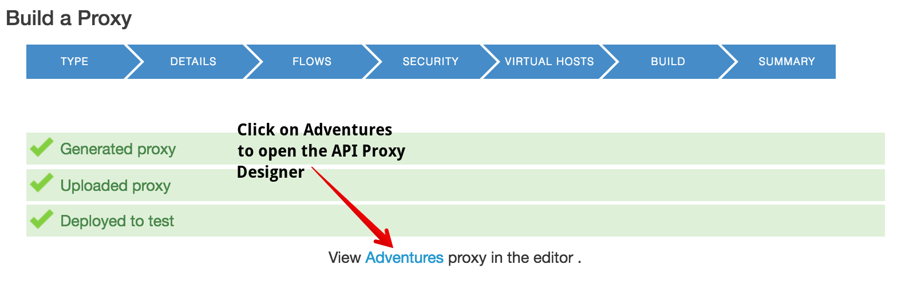

Click on the *Adventures* link to open up your new proxy in the API Proxy editor. This will launch the API Proxy Editor and you should see a page that looks like this:

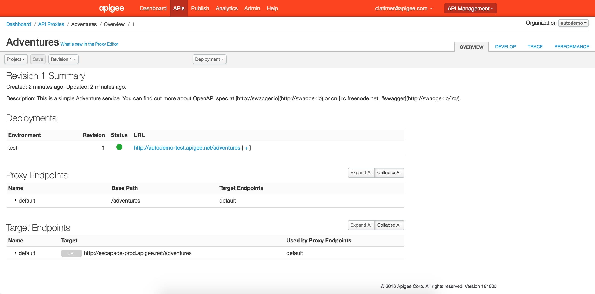

On this summary page, you should see a section called *Deployments*. This section of the page shows you the endpoints that you can use to access your API in each of the environments that this API has been deployed. In this case, you should see an endpoint for your API corresponding to the test environment:

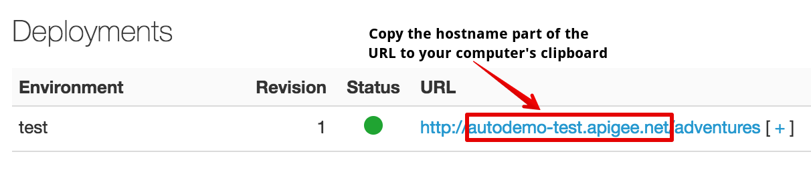

Your URL will look similar to this, except that instead of displaying `http://autodemo-test.apigee.net/adventures` yours will read `http://{your-orgname}-test.apigee.net/adventures` where `{your-orgname}` is replaced by the actual name of your Apigee organization. 

Copy just the *hostname* portion of your test environment endpoint to your clipboard. The hostname will not have the leading `http://` or the trailing path after `.net`. In the example above, the hostname would be `autodemo-test.apigee.net`

You'll use this hostname shortly to update your API client to point to your new API Proxy.

### Start a Trace Session

Apigee Edge includes a powerful trace tool that lets you inspect API calls as they are processed by your API Proxy. To start a trace session, click on the *Trace* tab in the top right of your window.This will bring you to the trace view of your API proxy:

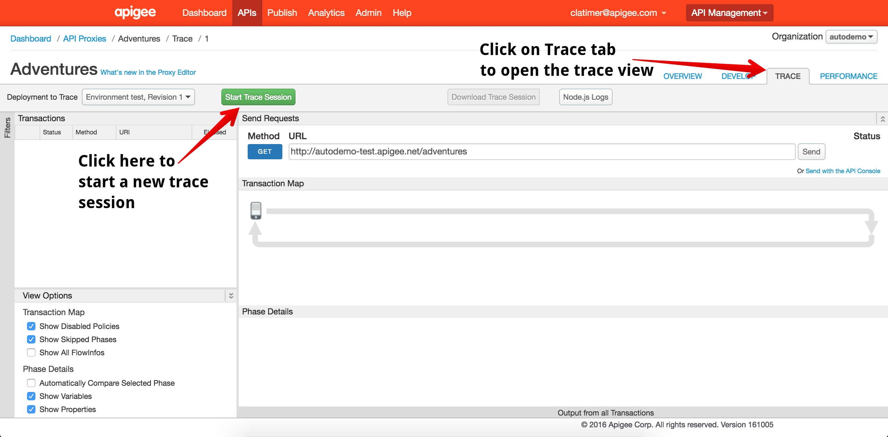 

To start a trace session, click on the green *Start Trace Session* button at the top of the tab. You should see the button turn to red with a timer counting down. This indicates that you have successfully started a trace session:

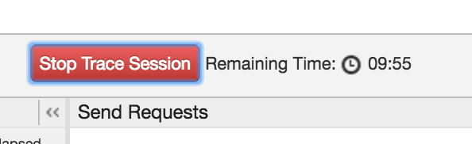 

Now you will send requests to your API and they will be automatically captured by your trace session.

### Update the Endpoint in API Studio

With your target hostname captured in your clipboard, return to your API Studio browser tab that you left open at the end of Lab 1. 

In the OpenAPI specification editor, scroll to the very top of the page. On line 13, you should see where the host for the API has been set:

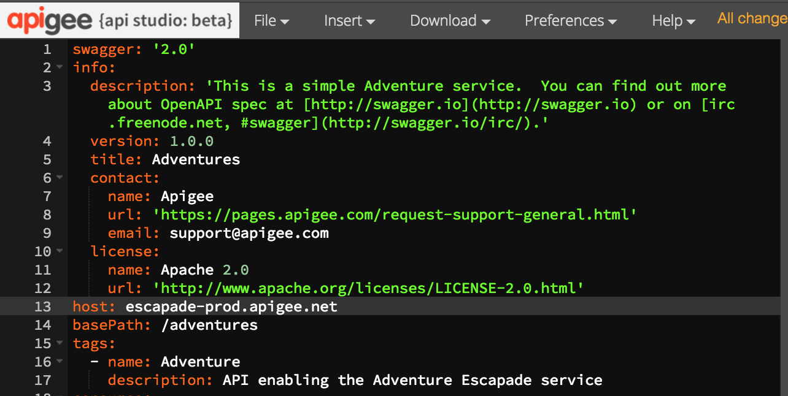

Replace the original hostname of `escapade-prod.apigee.net` with the hostname that you captured to your clipboard a moment ago.

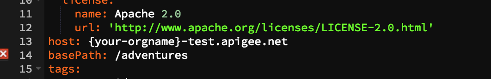

Just as you did in Lab 1, make a sample request to create a new reservation by finding the documentation view for the `POST /reservations` resource:

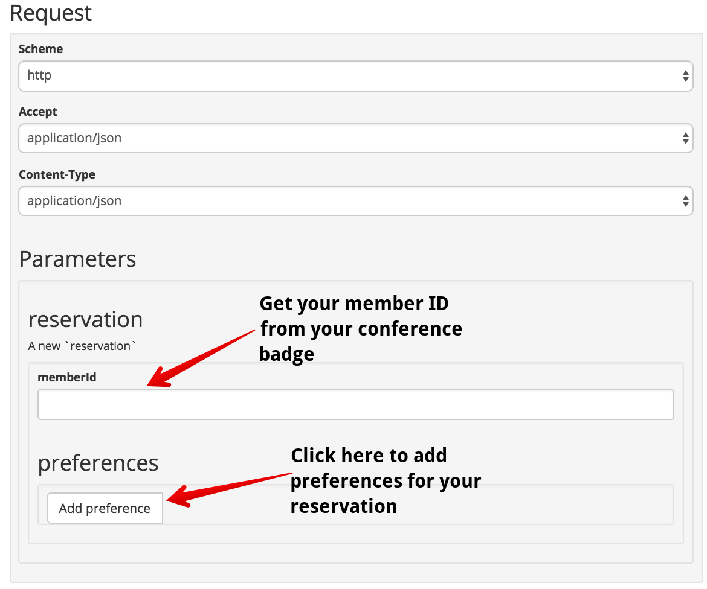

On your conference badge, you should see a member ID. Enter that member ID in the `memberid` field:

Click on the *Add Preference* button to specify your preferences for this reservation:

Once again you should see a successful response:

### View API Requests in Trace Tool

Return to the trace view in the Apigee Edge Management UI. You should now see detailed debug information for each API call that you made from the API Studio client:

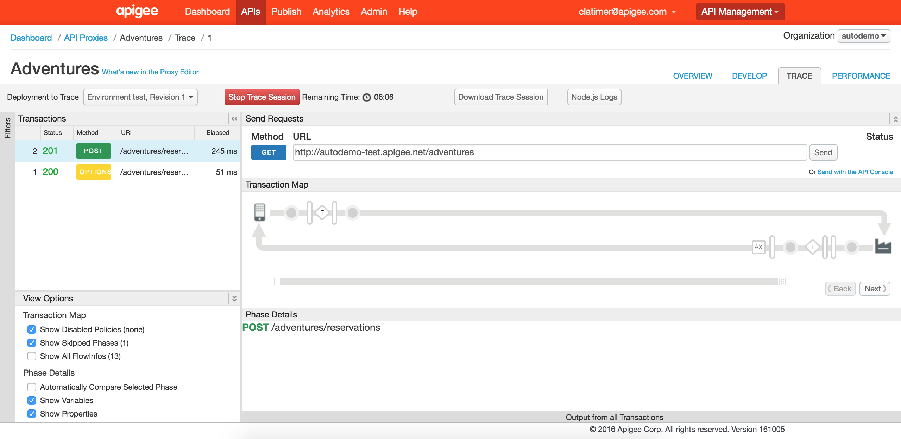

In this view, you can select individual API calls to see exactly what happened and to verify your API is behaving as expected. 

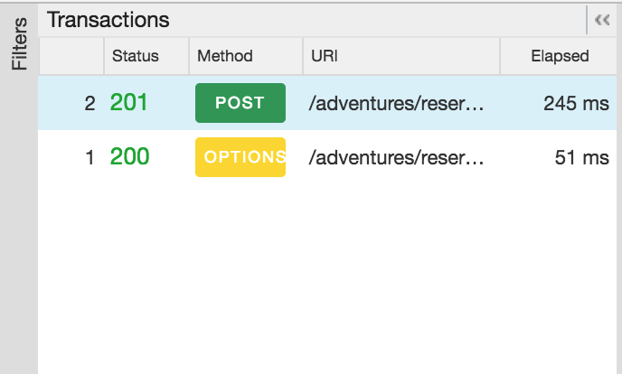

In later labs, the power of the trace tool will become even more evident as we configure new capabilities and use trace as a highly effective testing tool.

### Up Next

In this lab, you've created a new API proxy and used the trace tool to inspect traffic as it flows through your Apigee Edge instance. In the next lab, you'll implement basic traffic management and throttling capabilities on top of your API.

When you're ready, get started on [Lab 3 - Throttling the API with Spike Arrest](lab3.md) 

