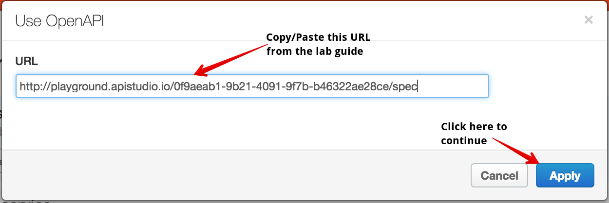

# Lab 2 - Exposing the API through Apigee Edge

In this lab, we'll create an API Proxy inside of Apigee Edge using the Management UI. You can access the Management UI by visiting <a href="https://enterprise.apigee.com" target="_blank">https://enterprise.apigee.com</a>

If you do not have an Apigee account, please go back to the *Getting Started* section of the [project overview page](README.md) and follow the instructions there to get your account set up.

Once you have accessed the Management UI, you should see a Dashboard page that looks similar to this:

# Creating the API Proxy

From the Management UI dashboard, select the APIs -> API Proxies option from the main menu at the top of the page. 

This will take you to a list of all the *API Proxies* that have been created in your Apigee Edge instance (called an organization in Apigee terminology). API Proxies are the building blocks for creating APIs in Apigee Edge. Create a new API Proxy now by clicking on the *+ API Proxy* button 

This will launch the API Proxy creation wizard:

Select the first option *Reverse proxy (most common)* and click on the *Use OpenAPI* button. This will bring up a dialog box asking you for a URL that points to your OpenAPI specification. 

In the URL field, enter the same URL that you used to import the API specification in API Studio: <a href="http://playground.apistudio.io/0f9aeab1-9b21-4091-9f7b-b46322ae28ce/spec" target="_blank">http://playground.apistudio.io/0f9aeab1-9b21-4091-9f7b-b46322ae28ce/spec</a>