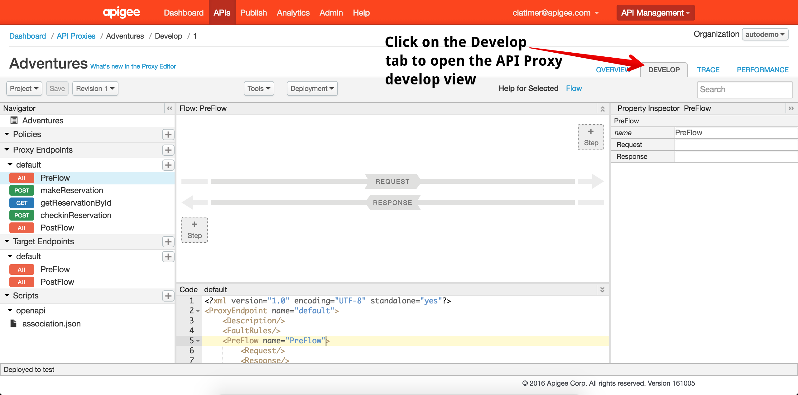
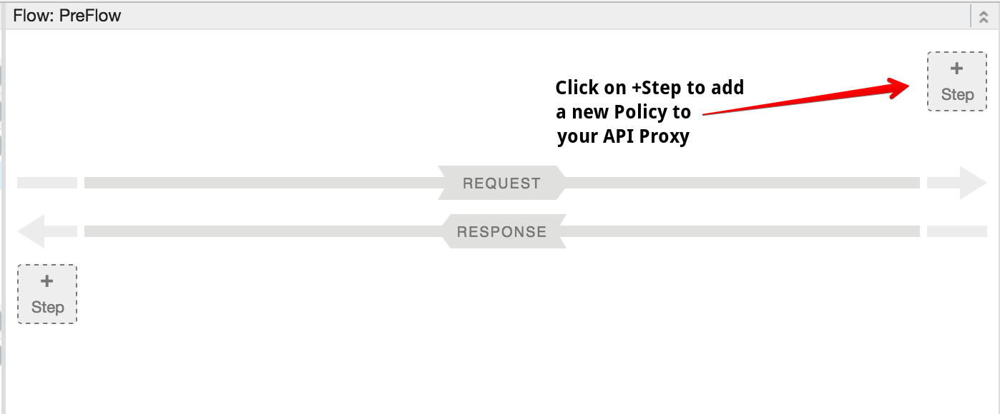
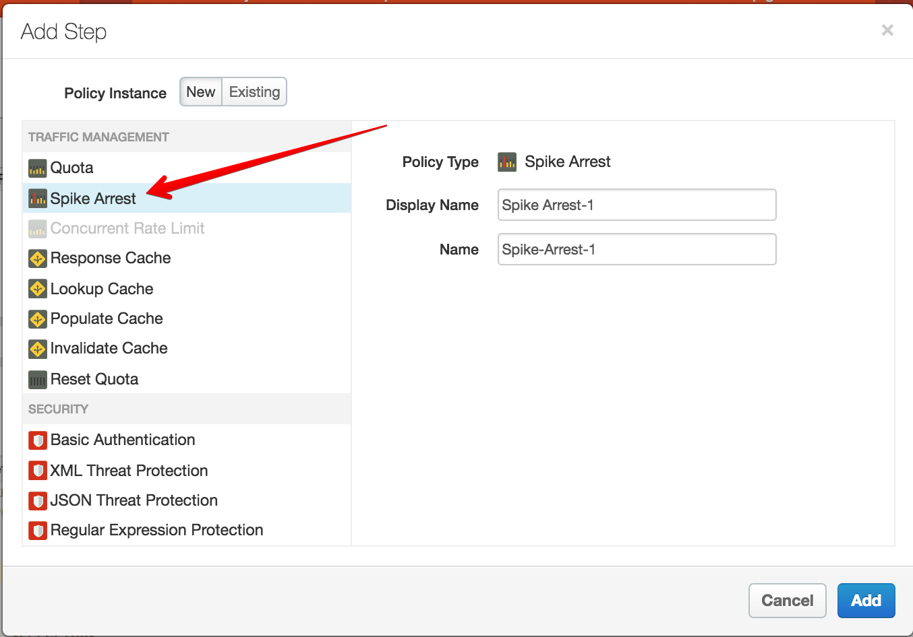
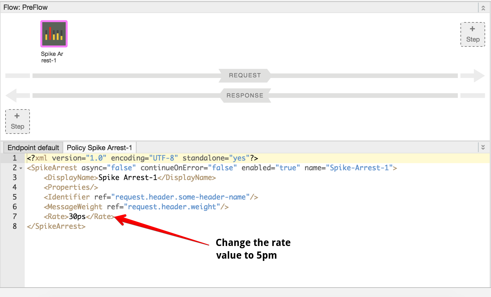
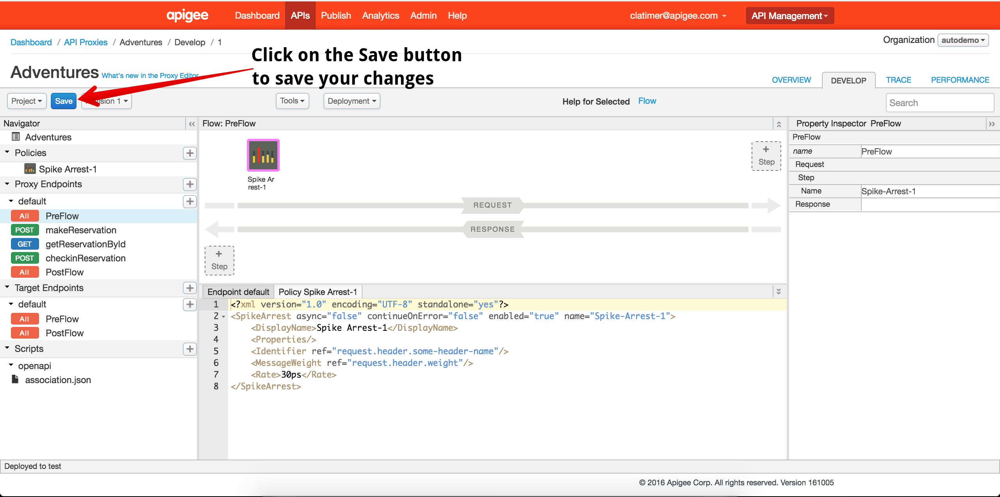

# Lab 3 - Throttling the API with Spike Arrest

Navigate to the Design tab of the API Proxy editor. This will bring you to the design view of your API proxy which will look like this:

## Add a Spike Arrest Policy

In the top right of the request-response pipeline, click on the *+ Step* button:

This will reveal a list of policies that you can attach to your API Proxy. Select the Spike Arrest Policy from the list. 

Leave the *Display Name* and *Name* fields as is and click on the *Add* button. This will add a new Spike Arrest policy to your API Proxy. 

By default, this policy will throttle traffic at a rate of 30 requests per second (30ps). To test the throttling behavior, change the rate of your Spike Arrest policy to 5 per minute. To do this, replace 30ps with 5pm. 

Once you have made this change, click on the blue *Save* button to save your changes and automatically deploy your API Proxy. 

