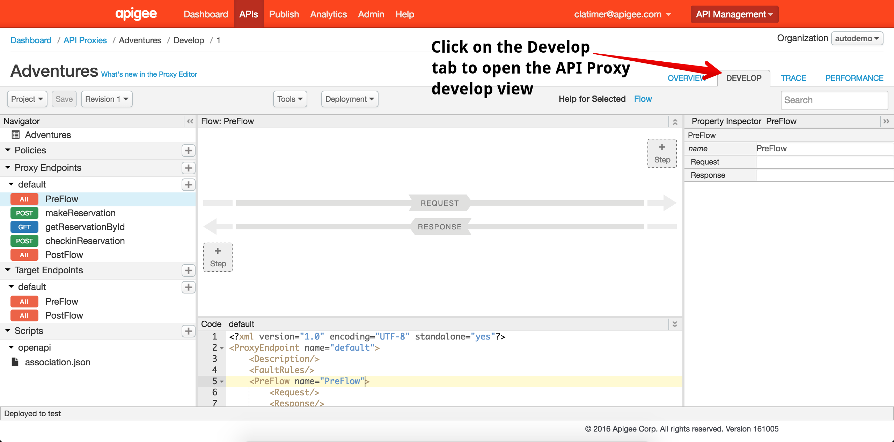
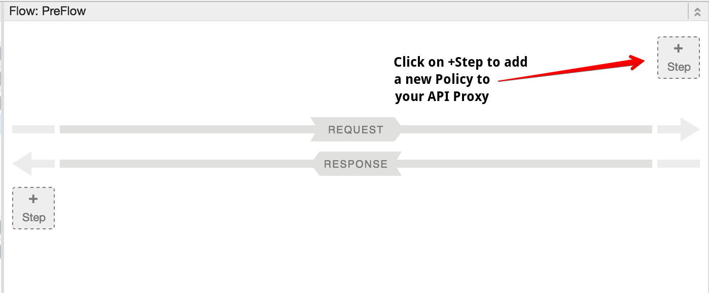
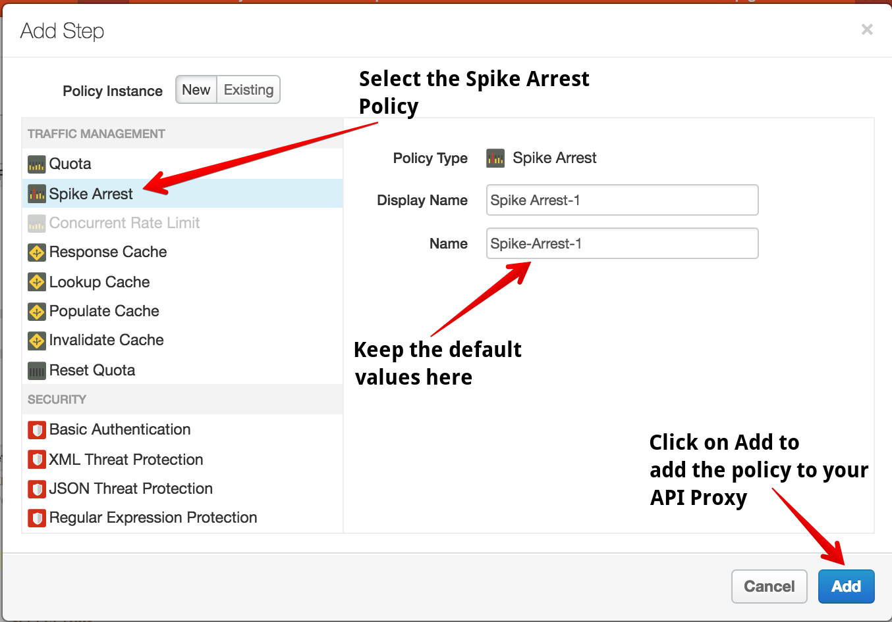
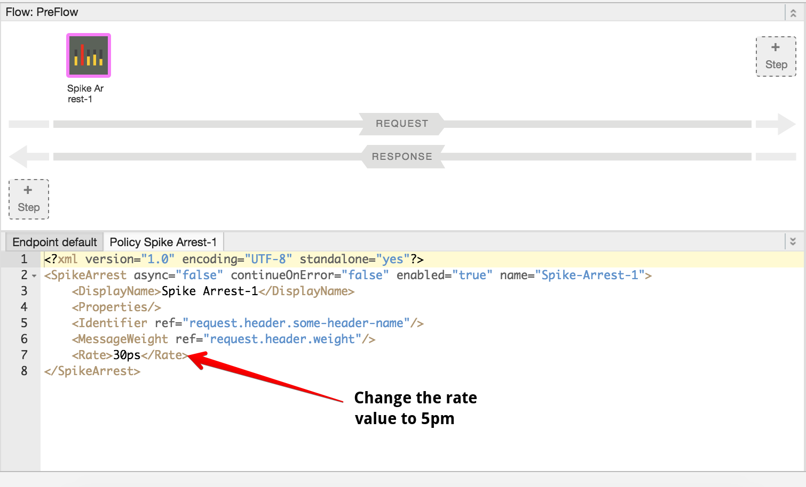
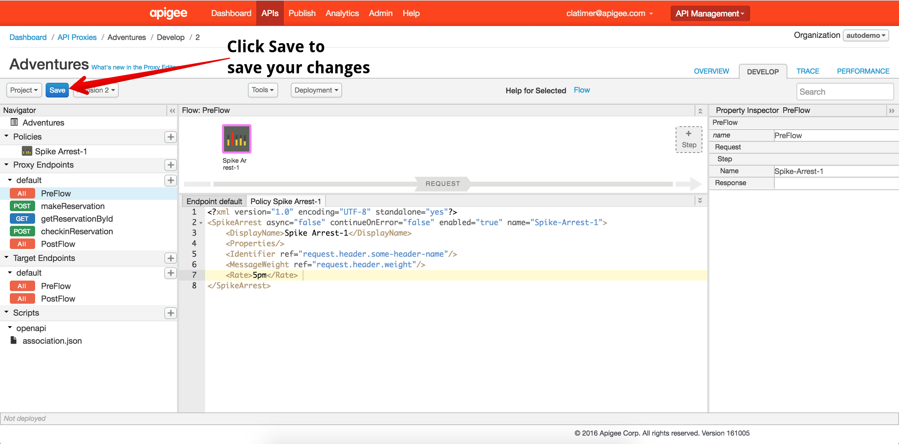
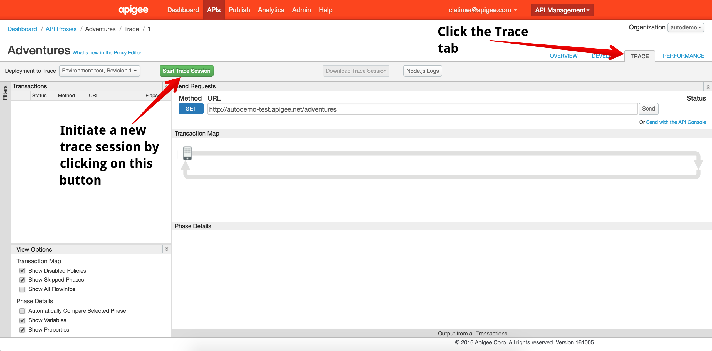
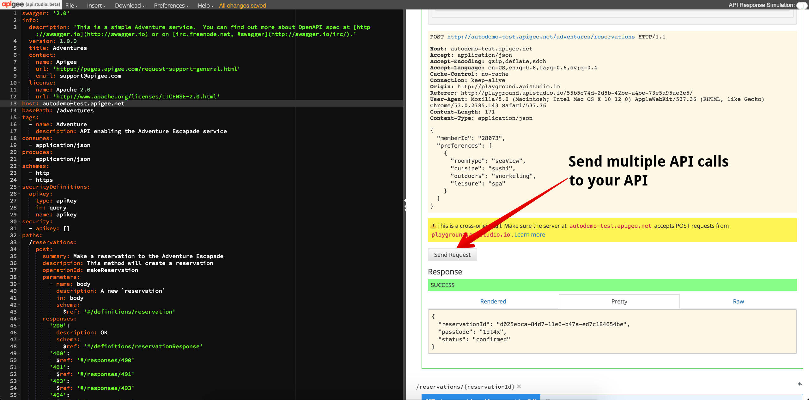
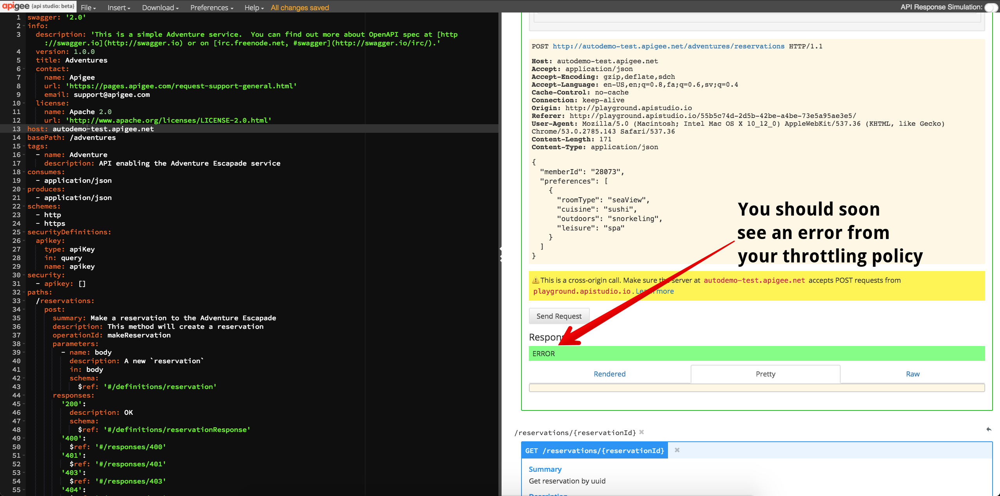
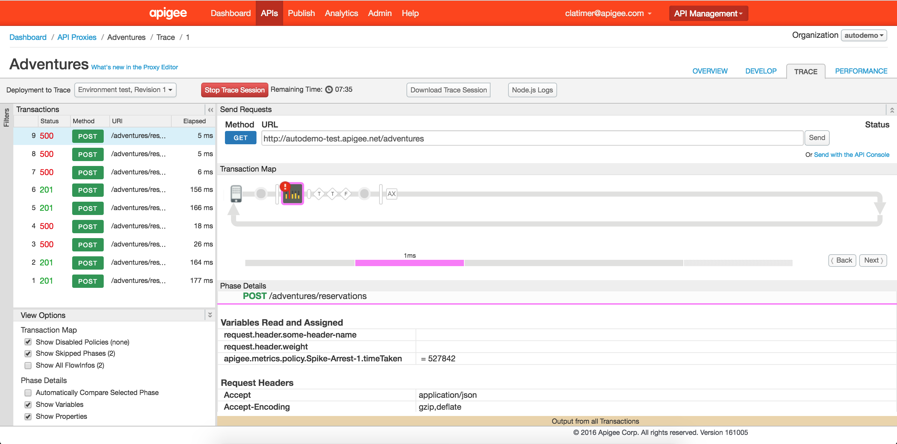

# Lab 3 - Throttling the API with Spike Arrest

Navigate to the Design tab of the API Proxy editor. This will bring you to the design view of your API proxy which will look like this:

## Add a Spike Arrest Policy

In the top right of the request-response pipeline, click on the *+ Step* button:

This will reveal a list of policies that you can attach to your API Proxy. Select the Spike Arrest Policy from the list. 

Leave the *Display Name* and *Name* fields as is and click on the *Add* button. This will add a new Spike Arrest policy to your API Proxy. 

By default, this policy will throttle traffic at a rate of 30 requests per second (30ps). To test the throttling behavior, change the rate of your Spike Arrest policy to 5 per minute. To do this, replace 30ps with 5pm. 

Once you have made this change, click on the blue *Save* button to save your changes and automatically deploy your API Proxy. 

## Start a Trace Session

Just as in the previous lab. Navigate to the Trace tab and click on the green *Start Trace Session* button to begin a new trace session:

## Test Your Configuration

Return to your API Studio browser tab. Just as in previous steps, send multiple API calls to your API.

 As you exceed the *frequency* of API calls that you specified in your Spike Arrest policy, you should begin to see errors.

## View Results in the Trace Tool

Return to the Apigee Edge Management UI and view the trace session for your API. You can now verify that your throttling policy is rejecting traffic. 

## FAQ

Many people who first encounter the Spike Arrest policy ask the question: "I configured the Spike Arrest for 5 calls per minute, but it rejected calls after just 2-3. Why?"

The Spike Arrest provides protection against sudden spikes in traffic. Imagine if you configured your Spike Arrest policy to allow 1,000 calls per minute. If all 1,000 calls are made in the first second of a given minute, it may still overload your backend. Spike Arrest can smooth out the traffic pattern of incoming calls.

For cases where you want to allow a specific number of API calls regardless of the rate, you can use the Quota policy instead. 

## Up Next

In this lab, you configured basic traffic throttling. You configured your first policy, used the API client inside API Studio to test your policy, and used the trace tool to verify that your API was working correctly.

When you're ready, get started on [Lab 4 - Improving API performance with Caching](lab4.md) 
