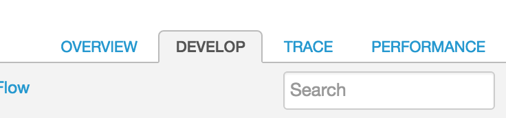

# Lab 3 - Throttling the API with Spike Arrest

Navigate to the Design tab of the API Proxy editor:

This will bring you to the design view of your API proxy which will look like this:

## Add a Spike Arrest Policy

In the top right of the request-response pipeline, click on the *+ Step* button:

This will reveal a list of policies that you can attach to your API Proxy. Select the Spike Arrest Policy from the list. 

