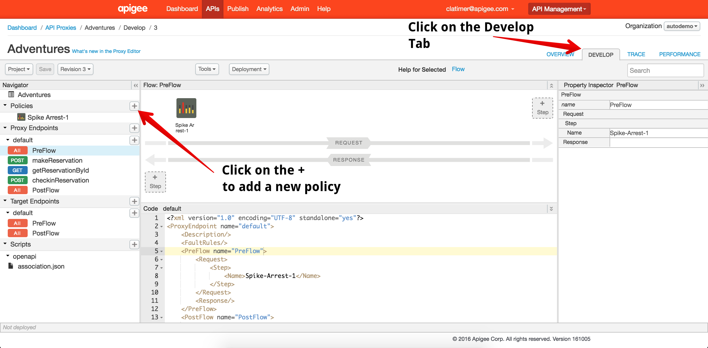
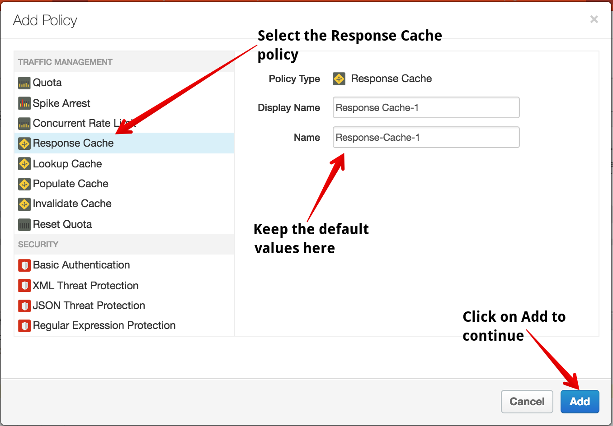
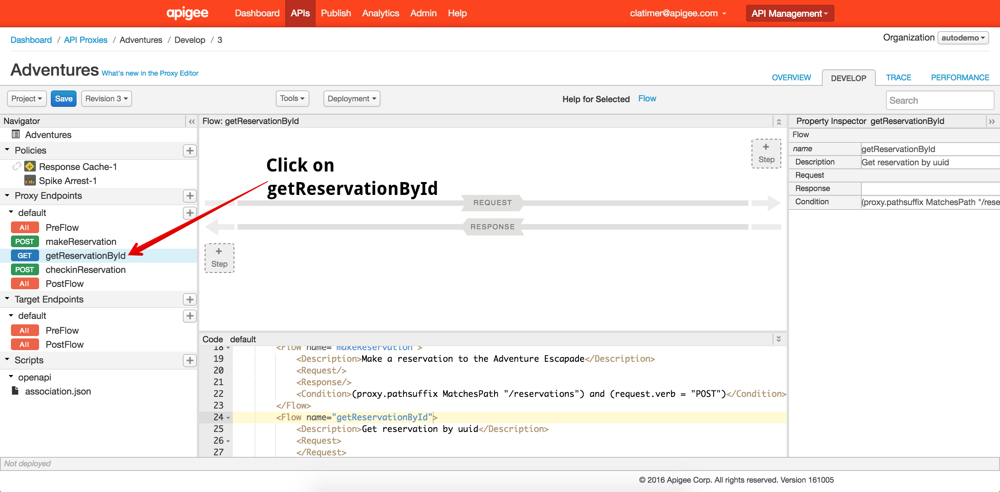
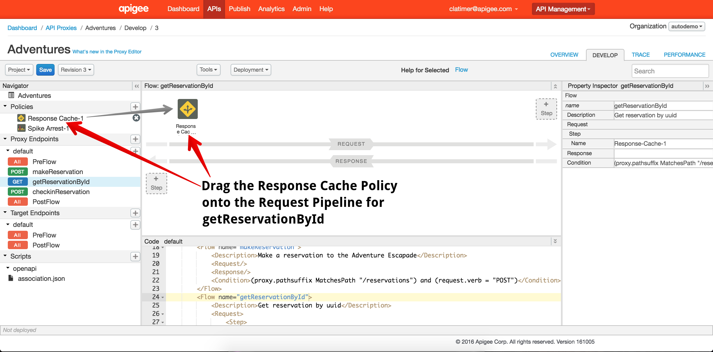
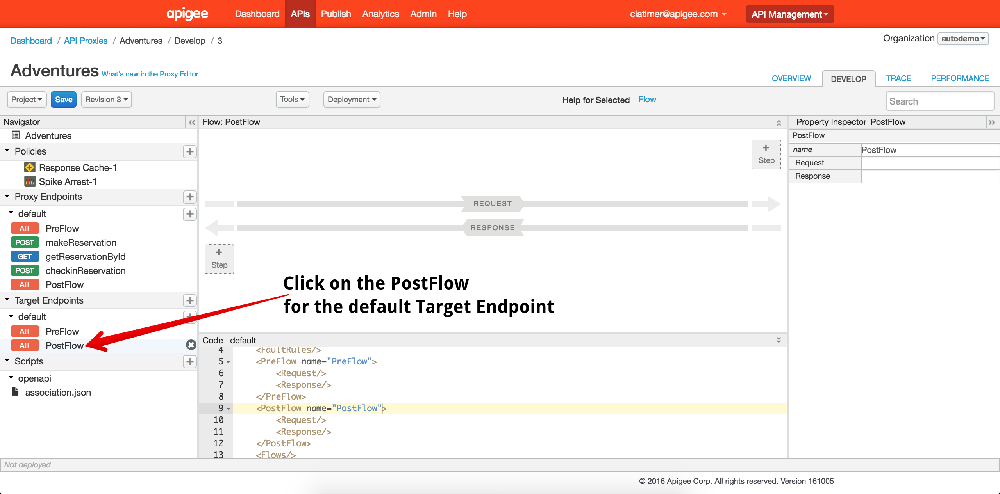
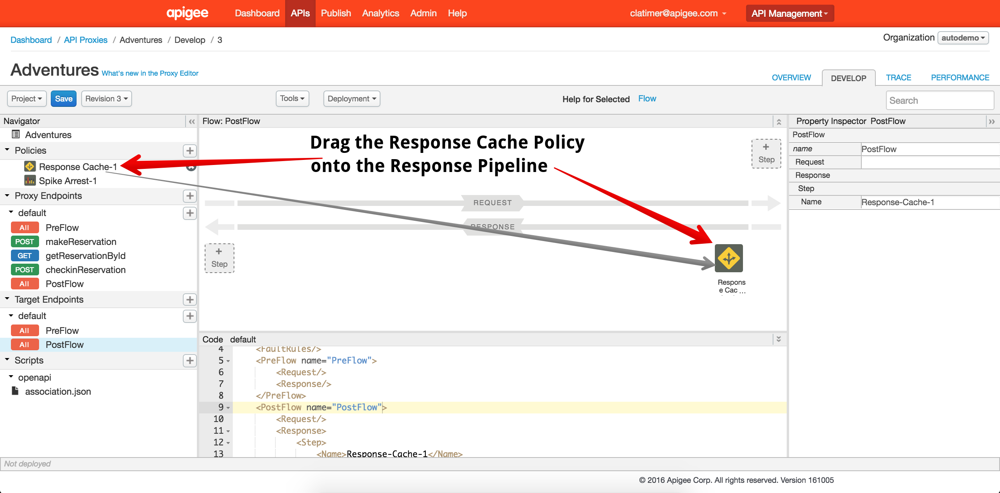

# Lab 4 - Improving API performance with Caching

In this lab, we'll implement response caching to improve the performance of one of our API resources.

## Configure the Caching Policy

Return to the Apigee Edge Management UI open. Navigate to the Design Tab of your API Proxy within the Proxy Editor view. 

Click on the *+* button next to the Policies list in the left hand navigation pane. This will launch a dialog box where you can configure a new policy. In this case, we'll create a Response Cache policy:

In the Navigator pane on the left side of the Proxy Editor, you'll see a list of conditional flows underneath the default Proxy Endpoint. Select the flow called `getReservationById`. 

Once you have selected the `getReservationById` flow, drag the Response Cache policy from the policy list into the Request Pipeline:

With this configuration, your API proxy will check the cache each time a reservation lookup API call is made. Next, we need to configure your API proxy to populate the cache when you get a response from the backend service. To do this, select the Post Flow for your default Target Endpoint:

Once you have the default Target Endpoint Post Flow selected, drag the Response Cache policy from the policy list to the Response Pipeline:

