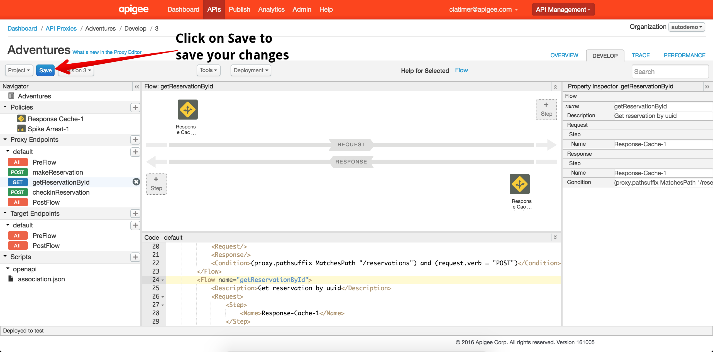
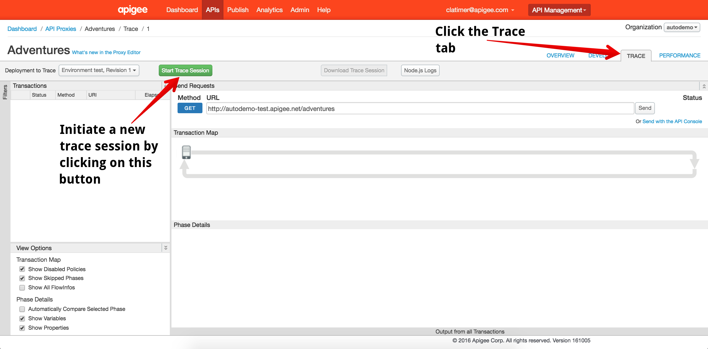

# Lab 4 - Improving API performance with Caching

In this lab, we'll implement response caching to improve the performance of one of our API resources.

## Configure the Caching Policy

Return to the Apigee Edge Management UI open. Navigate to the Design Tab of your API Proxy within the Proxy Editor view. 

Click on the *+* button next to the Policies list in the left hand navigation pane. This will launch a dialog box where you can configure a new policy. In this case, we'll create a Response Cache policy:

In the Navigator pane on the left side of the Proxy Editor, you'll see a list of conditional flows underneath the default Proxy Endpoint. Select the flow called `getReservationById`. 

Once you have selected the `getReservationById` flow, drag the Response Cache policy from the policy list into the Request Pipeline:

With this configuration, your API proxy will check the cache each time a reservation lookup API call is made. Next, we need to configure your API proxy to populate the cache when you get a response from the backend service. To do this, select the Post Flow for your default Target Endpoint:

Once you have the default Target Endpoint Post Flow selected, drag the Response Cache policy from the policy list to the Response Pipeline:

Once you have added the cache policy to the reponse pipeline, click on the blue *Save* button in the top left to save your changes:

## Start a Trace Session

Just as in the previous lab. Navigate to the Trace tab and click on the green *Start Trace Session* button to begin a new trace session:

## Test Cache Configuration

You should have made several test API calls to the `POST /reservations` resource from API Studio in previous labs. Inspect the response from your last API call and copy the `reservationId` value into your clipboard:

With your reservationId copied, scroll down in the documentation to find the `GET /reservations/{reservationId}` resource. Click on the *Try this operation* button to reveal the parameters you can set on your sample API call. 

Paste the `resrvationId` into the `reservationId` field in the API form. Make a request to the API. The first request will be slow and take about 10 seconds to return. Subsequent requests should return much faster.

Once you have made several requests to retrieve your reservation you should have noticed a significant improvement in response time after the initial request. Navigate back to your trace session and observe the improvement in response time. 

## Up Next

In this lab, you configured a response cache policy to reduce the response time of a poor performing API from 10 seconds down to a few milliseconds. Apigee Edge also provides fine grained cache policies that can be used for partial response caching or to cache arbitrary data.

When you're ready, you can get started on [Lab 5 - Complete reservation check in using the API](lab5.md)