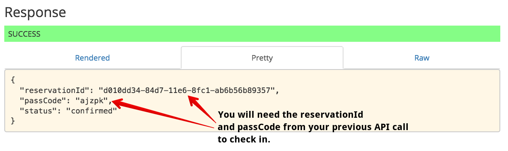
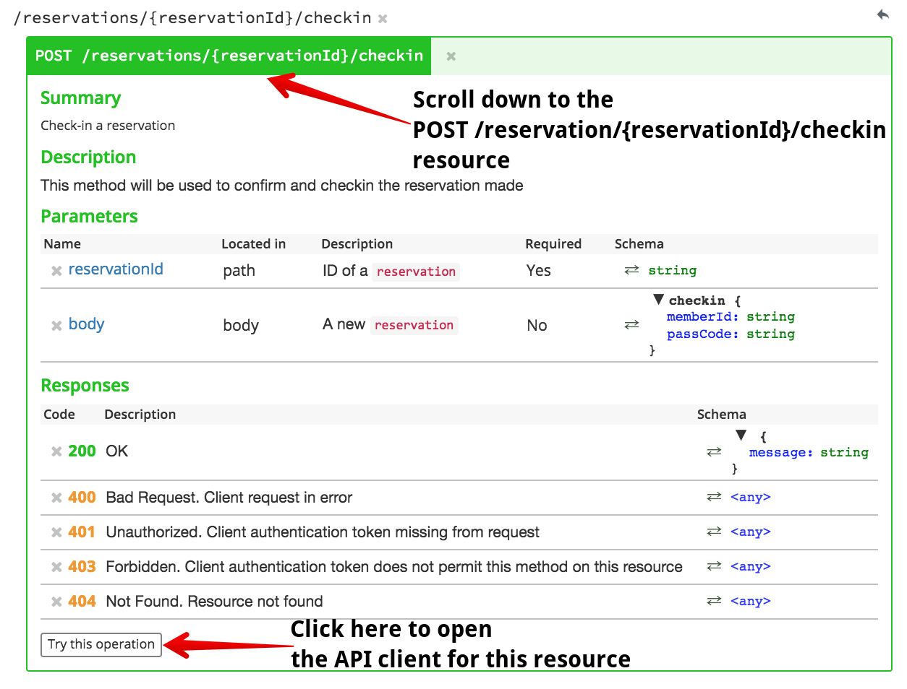
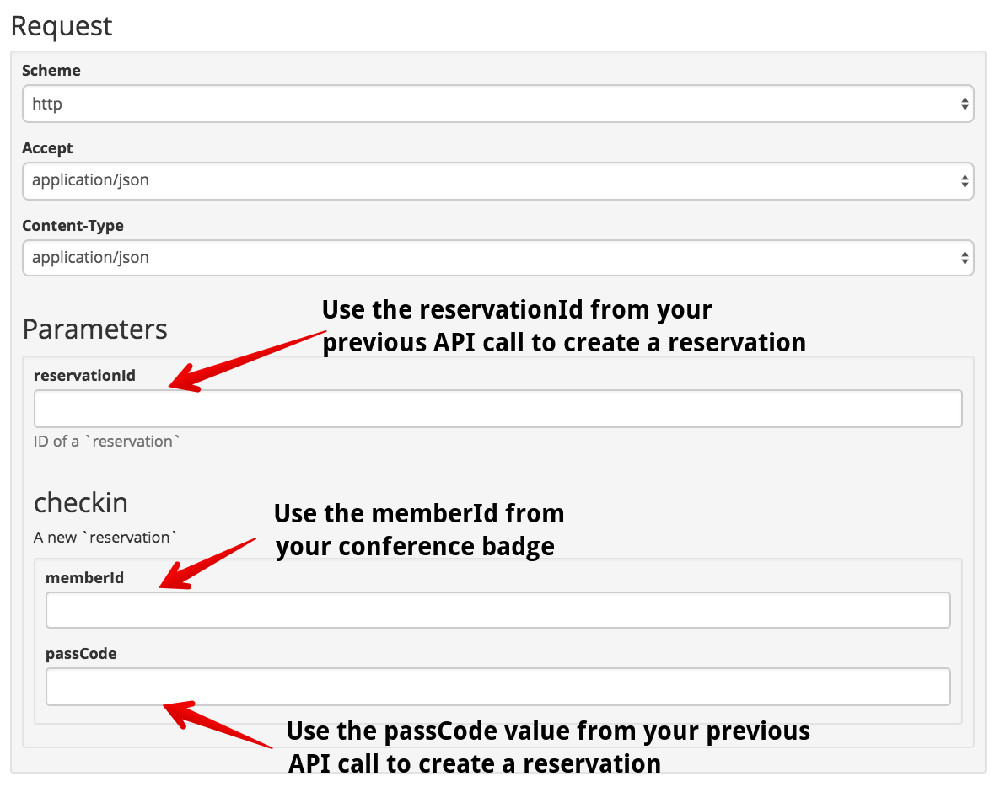
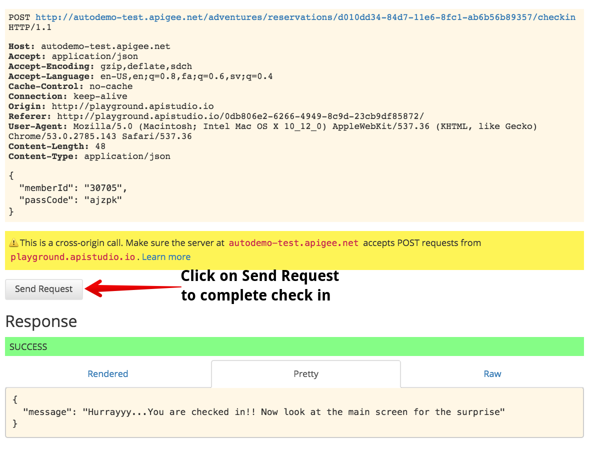

# Lab 5 - Complete reservation check in using the API

In Lab 5, you will make a call to the `POST /reservation/{reservationId}/checkin` resource to trigger an action in the demonstration app.

## Complete Check In for your Reservation

Return to API Studio, to completely the check in process you will need your `memberId` from your conference badge as well as the `reservationId` and `passCode` from your previous call to create a new reservation. 

Scroll down in the documentation pane on the right half of API Studio to find the `POST /reservations/{reservationId}/checkin` method. Then click on the *Try this operation* button to reveal the API client for this method:

Enter your `memberId`, `reservationId`, and `passCode`. `memberId` can be found on your conference badge just as in previous labs. `passCode` and `reservationId` will both be retrieved from the API call you made in a previous lab. If you don't have access to the previous API call, just create a new reservation by making a call to `POST /reservations` in API Studio. 

Once you have populated the API Client form, click on *Send Request* to send your API request:

If all went well, you should see a customized confirmation on one of the main displays in the front of the conference session.

## Congratulations!

You've successfully completed all the labs for this conference session! You've barely scratched the surface of working with Apigee Edge. To explore more features of Apigee Edge and to see how Apigee can help you create a highly successful API platform for your organization, check out the [Developer Resources](https://apigee.com/about/developers) on apigee.com. 

